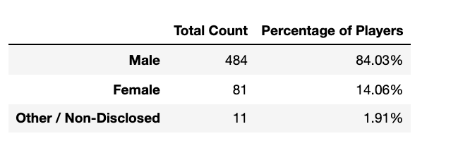
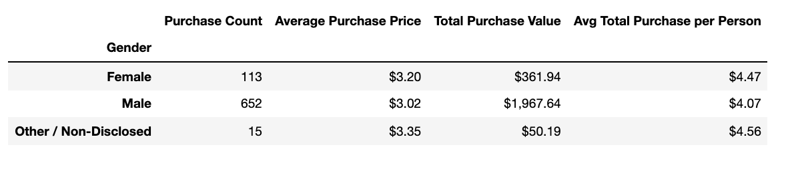
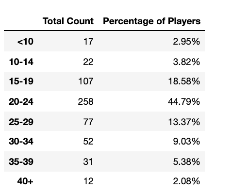
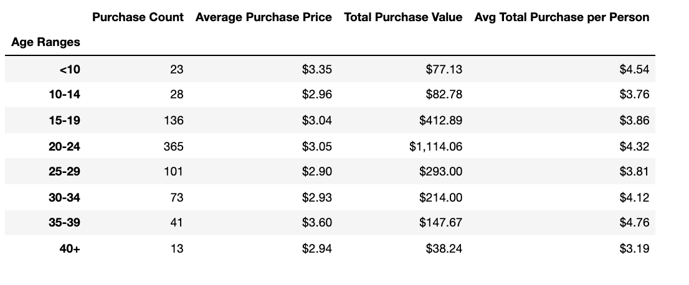
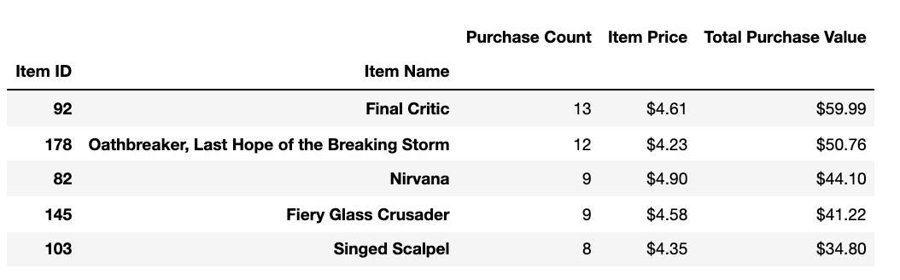
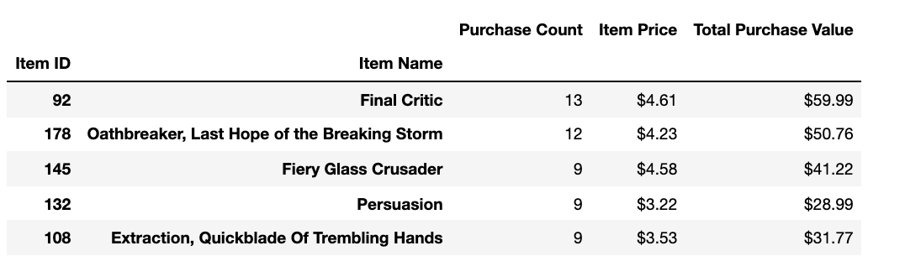

# Analyzing fantasy game using Python Pandas 

## Heroes of Pymoli
My task was to analyze the data for the fantasy game Heroes of Pymoli. Like many others in its genre, the game is free-to-play, but players are encouraged to purchase optional items that enhance their playing experience. 
First task was to generate a report that breaks down the game's purchasing data into meaningful insights.

Final report includes each of the following:
- Player Count
- Purchasing Analysis (Total)
- Gender Demographics
- Purchasing Analysis (Gender)
- Age Demographics
- Top Spenders
- Most Popular Items
- Most Profitable Items

## Three observable trends based on given data
* Based on data analysis, we calculated that the game had a total of 576 players that made at least one purchase. The purchses were made predominantly by males, which comprise roughly 84% of the player base. A total of \\$1,967.64 were spent on in-game items by males, with each spending an average of \\$4.07.
 
* If we analyze the data by age categories, we can observe that the vast majority of the buyers are in the 20-24 age category, with 258 players and a 45% share of the player base. On average, each player in this age category spends $4.32. Kids younger than 10 years of age and adults older than 40 years of age spent the least amount of money in comparison to the other age categories. Total purchases made by these two age groups amount to only 36 transactions, and about 5% of the total sales volume. The age categories of 15-19 years, and 20-24 years contributed to the game sales the most, with roughly 2/3 of both the sales volume and the player base. If I was the marketing manager for this company, the choice would be obvious to sell to 15-24 year olds rather than kids and adults over 40.
 
* By further analyzing the sales data, we determined that the most profitable item in the game is the "Final Critic". It was purchased 13 times and brought in \\$59.99. The second most profitable item in the game is the "Oathbreaker", with sales of 12 units and revenue of \\$50.76. While those two items are both most popular and most profitable, there is a discrepancy starting with the third item in these lists.
 

## For the Project I used Python Pandas library and a Jupyter Notebook.
